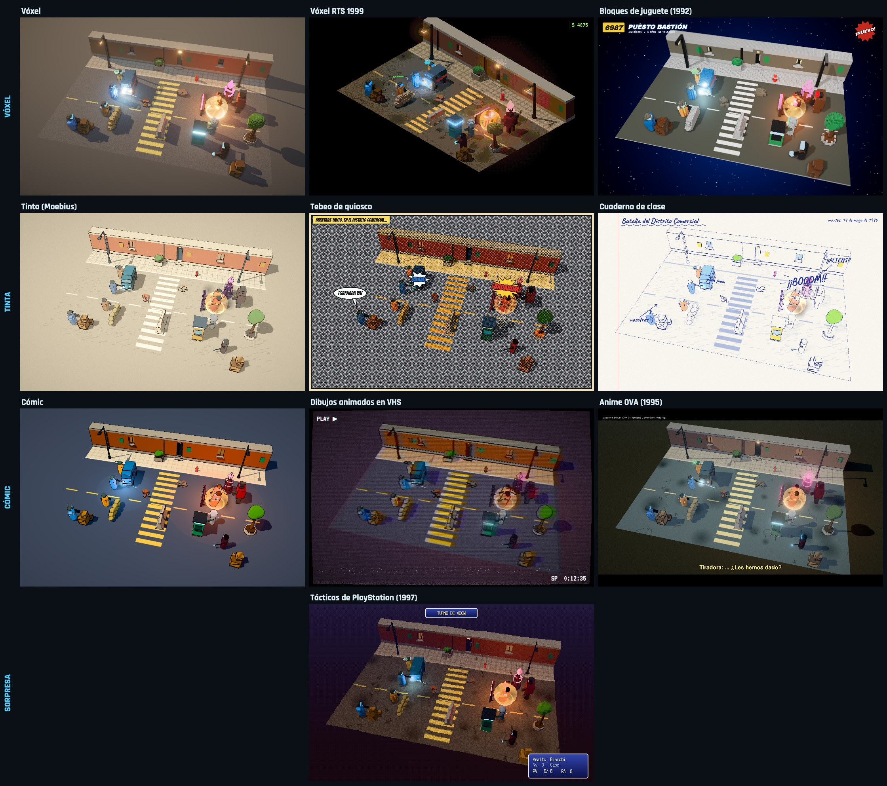
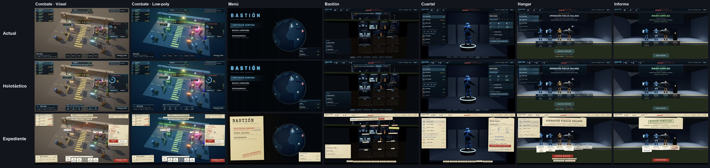
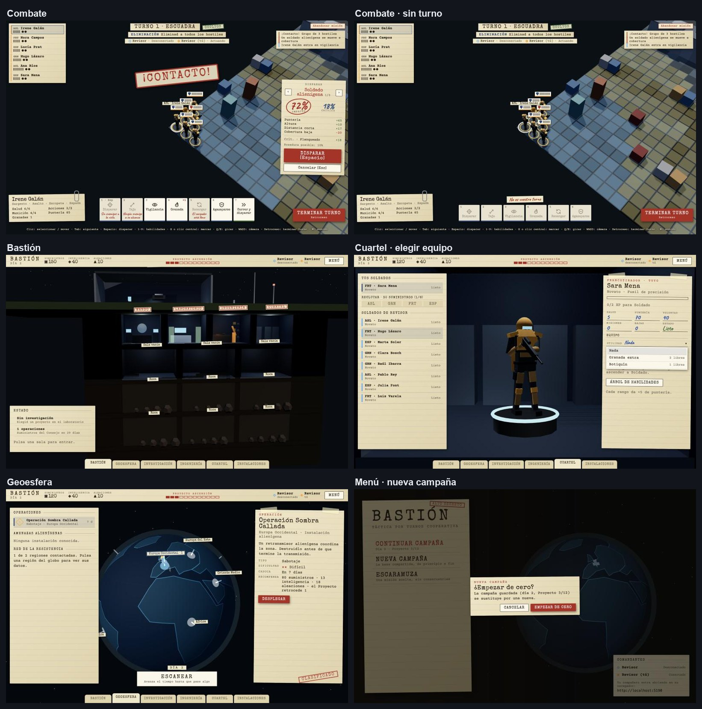
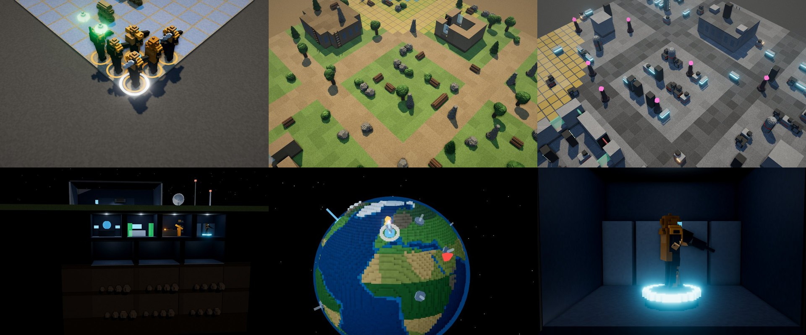
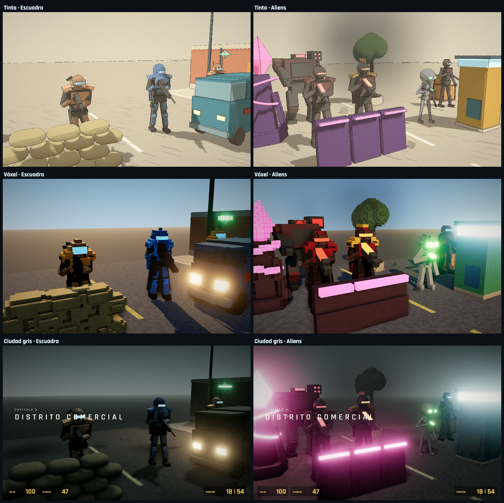
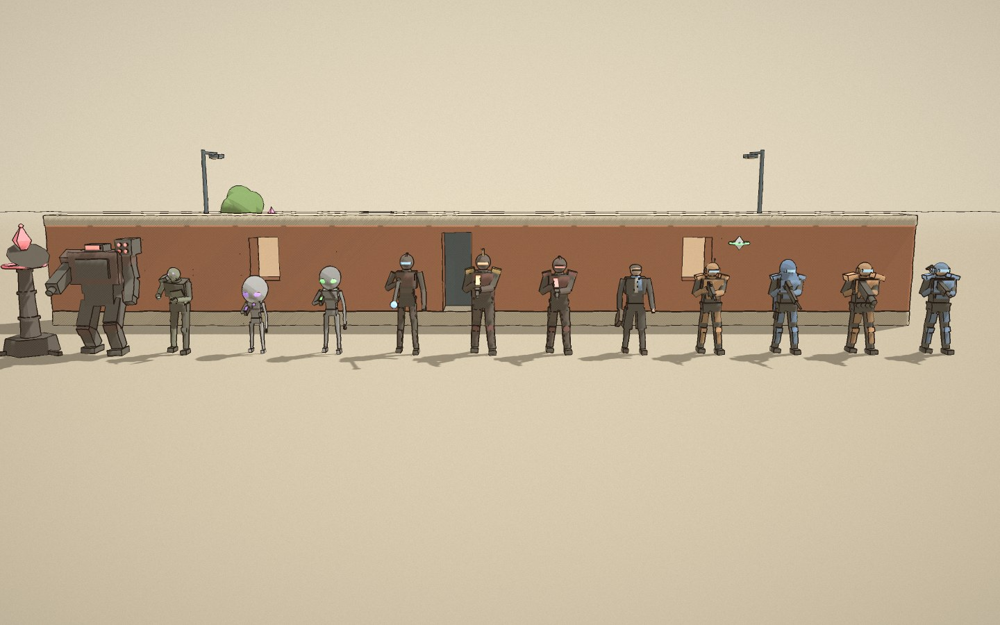
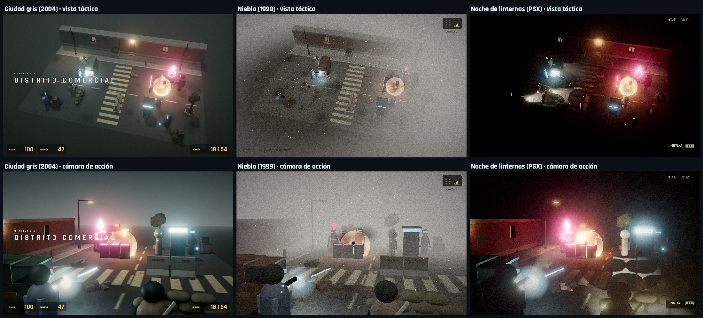
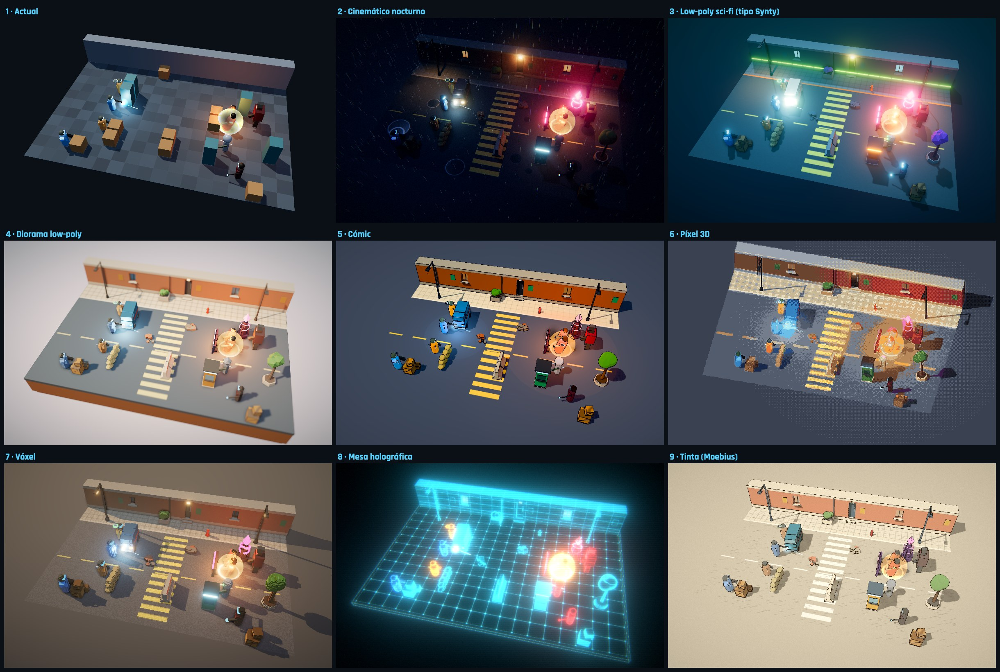

# Dirección de arte (M5)

Primer paso del M5: decidir el estilo antes de producir modelos. Para eso hay un **laboratorio de estilos** que pinta la misma escena —una esquina de calle con la escuadra a cubierto, un grupo alienígena y un intercambio de disparos y una granada— en diecinueve estilos, con los modelos y la escala reales del juego.

**Estado (2026-10-05):** el arte elegido es **Vóxel** y **Low-poly sci-fi (tipo Synty)**, los dos con 5★ en el comparador. La interfaz **Expediente** está aplicada al juego (ver "Interfaz") y **todo el juego es vóxel**: combate, base y geoesfera (ver "Vóxel en el juego"); low-poly queda como alternativa. El resto de estilos y temas quedan descartados; las secciones de abajo los conservan como historial.

## Cómo verlo

Con el servidor de desarrollo arrancado (`npm run dev`), abre **`/estilos.html`**: `http://localhost:5173/estilos.html`. Tu compañero puede verlo por Tailscale con la IP del host.

| Tecla | Acción |
|---|---|
| `1`–`9`, `0`, `←` `→` | Cambiar de estilo (el menú los agrupa por familia; los de la primera ronda que no gustaron están en "Aparcados") |
| Arrastrar / rueda | Girar y acercar la cámara |
| `M` | Momento clave: congela el disparo con la explosión |
| `Espacio` | Pausa |
| `U` | Interfaz táctica (alcance de movimiento, ruta, cobertura) para juzgar la legibilidad |
| `H` | Ocultar paneles |

**Comparador** (`/comparar.html`, y publicado en https://claude.ai/artifact/SzPjfwziyzaYuPFWE1iSMX): dos o cuatro estilos en vivo con la misma cámara y el mismo instante del combate, o una cortina que se arrastra para pasar de uno a otro. Cada persona puntúa los estilos (1–5 estrellas y una nota) y ve la clasificación con los votos de los demás. Publicado, los votos se comparten entre quienes tengan acceso a la página; en local se guardan en el navegador. Para regenerar la versión publicada: `npx vite build -c vite.lab.config.ts --outDir <carpeta>` en `packages/client` y publicar esos archivos.

El código vive aislado en `client/src/lab/` y no toca el juego. Cada estilo es una lista de decisiones (materiales por *rol*, luz, suelo, posproceso y una capa 2D opcional para rótulos y onomatopeyas). La primera ronda está en `lab/styles.ts`, la segunda en `lab/styles90.ts` y el orden del menú en `lab/catalog.ts`. Los objetos se construyen una vez en `lab/kit.ts` y cada estilo los interpreta. `game/voxel.ts` (compartido con el juego) convierte cualquier modelo en vóxeles, cúbicos o con forma de ladrillo con *studs*, y `lab/post.ts` contiene los efectos de pantalla.

## Interfaz (2026-10-05)

**Laboratorio:** `http://localhost:5173/interfaz.html`. Es una maqueta en HTML de todas las pantallas:

- **Combate:** el HUD táctico sobre la escena del laboratorio, con fondo Vóxel o Low-poly (los dos estilos elegidos).
- **Campaña:** menú principal, Bastión, geoesfera, investigación, ingeniería, cuartel, ascenso, instalaciones, hangar, informe y acontecimiento. Van sobre el Bastión y el globo 3D del propio juego, con una campaña de ejemplo (día 12, laboratorio y taller construidos, enfermería en obras). El fondo 3D es el actual; cambiará cuando se pase a vóxel o low-poly.

Los textos y datos salen del juego real. Se puede enlazar a una combinación concreta: `?tema=expediente&pantalla=cuartel&fondo=polygon`.

Quedan tres temas:

- **Expediente**, el que gusta: carpeta clasificada con papel, máquina de escribir, sellos de goma, clips y notas a boli del compañero.
- **Holotáctico**, la evolución directa de la actual.
- **Actual**, como referencia.

Se descartaron Viñeta, Consola 90, Terminal CRT y Juguete, porque estaban pensados para estilos de arte que no se han elegido (cómic, PlayStation, Vóxel RTS 1999 y Bloques).

El código está en `client/src/lab/ui/`, aislado del juego: `uilab.ts` (página y temas), `screens.ts` (maquetas de campaña), `uilab.css` y `screens.css` (piezas comunes) y `themes.css` y `themes-base.css` (cada tema). Todas las pantallas se construyen con las mismas piezas: panel, fila de lista, ficha de detalle, barra, botones, tarjeta, ventana y barra de votación. Por eso cada tema solo tiene que vestir esas piezas una vez.

### Diagnóstico de la interfaz actual

- **Dos sistemas que no casan.** El combate (`styles.css`, variables `--*`) y la base (`strategy.css`, variables `--x-*`) tienen cada uno sus colores, con varios rojos y verdes distintos. La base usa esquinas cortadas y el HUD no.
- **Botones solo con texto.** El motivo de "no disponible" solo aparece en el tooltip nativo (`title`), que tarda en salir y en pantalla táctil no sale.
- **Abreviaturas crípticas** en los estados (VIG, AGZ, ATR, ROT…).
- **Controles del navegador sin estilo:** diálogos `confirm()` y `<select>` nativos.
- **CSS muerto** en `styles.css`.
- **Es genérica.** Es un homenaje correcto a XCOM 2, pero no dice nada del estilo de arte.
- **Lo bueno:** es sobria, no tapa la escena y las pantallas de estrategia están cuidadas.

### Expediente sobre vóxel y low-poly

- **El papel destaca bien sobre los dos fondos,** sobre todo sobre la noche azul verdosa del low-poly. Lo único que fallaba era la línea de jugadores bajo el objetivo, que ahora lleva su propia tira de papel.
- **En la campaña es donde más gana.** Las propuestas del compañero salen como pósits escritos a mano y su voto como un círculo a boli, lo que encaja con las decisiones compartidas.
- **La ficción tiene que justificarlo.** Mezcla papel con escenas sci-fi; por ejemplo, la resistencia tira de papel porque es lo único que los alienígenas no pueden interceptar.
- **Variante posible:** combate con un HUD más inmediato (Holotáctico) y base como carpeta (Expediente). Como las piezas son comunes, mantener dos pieles cuesta poco.

### Aplicada al juego (2026-10-05)

- **Un solo juego de variables** para combate, base y menú: `:root` de `styles.css`, con papel, tinta, sello rojo, boli azul y las tres fuentes. `strategy.css` traduce sus nombres `--x-*` a esas mismas variables.
  - Fuentes: Special Elite para los títulos, Courier Prime para el texto y Caveat para lo escrito a mano. Van en `@fontsource`, sin depender de internet.
- **Combate:**
  - Paneles de papel; el soldado elegido es una ficha con clip.
  - Habilidades como fichas con icono (`ui/icons.ts`, uno por habilidad). El motivo de "no disponible" va escrito a boli en la ficha; si es el mismo para todas (por ejemplo, no es vuestro turno), sale una sola vez encima.
  - Probabilidad de impacto rodeada con rotulador rojo.
  - Avisos ("¡CONTACTO!") como sellos de goma.
  - Etiquetas de papel sobre las unidades, con los estados en palabras completas.
  - Informe final sellado.
- **Base:**
  - Cabecera de papel y pestañas de carpeta abajo.
  - Ficha derecha pegada con celo; las operaciones llevan el sello "Clasificado".
  - Propuestas del compañero en pósit escritas a mano.
  - Cuartel como formulario rellenado a boli. El equipo se elige con un selector propio en lugar del desplegable del navegador.
  - Fotos de la escuadra con celo del color del jugador; los caídos llevan sello.
  - Motivos visibles bajo los botones desactivados (recursos que faltan, propuesta pendiente…).
- **Menú:** carpeta "Alto secreto". Empezar una campaña nueva pide confirmación con un diálogo propio, no el `confirm()` del navegador.
- **Limpieza:** se borró el CSS de pantallas que ya no existen (lobby y base antiguos).

## Vóxel en el juego (2026-10-05)

Se eligió "Todo vóxel": los modelos se siguen construyendo con primitivas y se convierten a vóxeles al cargarlos (`game/voxel.ts`). Si el estilo cambia, basta con no convertirlos.

- **Combate** (`game/models.ts`, `game/mapView.ts`, `game/props.ts`):
  - Soldados y alienígenas en vóxel de 1/16 de casilla. El esqueleto se conserva: cada hueso se convierte por separado, así que las animaciones siguen funcionando.
  - Decorado por bioma (cajas, sacos, contenedores; árboles, rocas, troncos; consolas, tanques, generadores), convertido una vez y repetido por instancias.
  - Las piezas grandes (suelo, muros, fachadas) no se convierten, porque serían millones de cubos. Llevan un *shader* que dibuja la rejilla de vóxeles sobre la superficie: ruido por celda, oscurecimiento por planta y ventanas en las fachadas.
  - Luz de día (cielo degradado, sol cálido, niebla fría) y posproceso: oclusión ambiental (GTAO) en esquinas y contactos, *bloom* en las luces y una gradación de color suave (`game/post.ts`).
- **Base** (`strategy/bastion.ts`):
  - Salas, máquinas, roca y nave en vóxel. Lo que se anima (radar, brazos robóticos, holograma) se convierte pieza a pieza para que siga moviéndose.
  - Las piezas translúcidas (holograma, tubos del laboratorio) también son vóxel y conservan la transparencia.
  - Las zonas que se pueden pulsar no cambian.
- **Geoesfera** (`strategy/geoscape.ts`):
  - La Tierra es un planeta de 72 vóxeles de diámetro: océano con aguas someras en la costa, tierra un escalón por encima, biomas por latitud (selva, desierto, sabana, templado, taiga, hielo) y algunas montañas con nieve.
  - Las normales se inclinan hacia las de la esfera para que los escalones del lado en sombra no salgan negros.
  - Marcadores, anillo de selección y nave también en vóxel; los marcadores se apoyan en la altura real del terreno.
  - Se construye una sola vez (unos 100 ms) y se reutiliza al volver de cada misión.
- **Coste** (M4): un mapa completo son unos 600 000 triángulos y 1,4 ms de render; el posproceso añade alrededor de 1 ms. Convertir un soldado tarda unos 13 ms; el decorado, unos 350 ms una sola vez.

## Modelos articulados (2026-10-04)

Los muñecos de cápsula se sustituyen por figuras con esqueleto (`game/figures.ts`): columna, cuello, hombros, codos, caderas, rodillas y tobillos. Los brazos alcanzan las empuñaduras del arma por cinemática inversa, las piernas se doblan para agacharse y correr, y hay animación de lanzamiento y de caída. Cada clase tiene su equipo:

- **Asalto:** escopeta y espada a la espalda.
- **Granadero:** armadura pesada, lanzagranadas, mochila y granadas al cinto.
- **Tirador:** capucha, capa, rifle largo y pistolera.
- **Especialista:** mochila con antena y dron.

Los alienígenas tienen cada uno su silueta: soldado, oficial con hombreras doradas, cresta y capa, lancero esbelto con porra, xenoide gris de cabeza grande y MEC con patas de articulación invertida y brazo-cañón. El estilo "Actual" conserva los muñecos de hoy para comparar. Las cámaras "Escuadra" y "Aliens" los muestran de cerca, y el especialista corre a la esquina de la furgoneta en cada ciclo para que se vean las piernas en acción.

Las figuras cumplen la interfaz `UnitRig` del juego y añaden `applyPose`. El juego ya las usa (`client/src/game/figures.ts`, integradas en la sesión de jugabilidad): `FIGURE_TEMPLATES` lista las 13 plantillas modeladas, que incluyen sectoide (gesto psiónico con la mano en la sien), zombi (brazos al frente, andar cojo), relé (antena con anillo giratorio que se derrumba al sabotearla) y VIP (civil desarmado con maletín). La cámara "Desfile" del laboratorio las enseña todas en fila detrás del edificio.

## Segunda ronda: variantes de los 90

| Familia | Estilo | Idea | Referencias | Coste |
|---|---|---|---|---|
| Vóxel | Vóxel RTS 1999 | Isométrica fija, baja resolución y paleta cerrada; contador de créditos y selección de RTS | Tiberian Sun, Blade Runner (Westwood) | Bajo |
| Vóxel | Bloques de juguete (1992) | Vóxeles con forma de ladrillo, *studs*, plástico brillante y fondo de catálogo espacial | Catálogos de LEGO Space de los 90 | Bajo (cuidado con la marca) |
| Tinta | Tebeo de quiosco | Trama CMYK descuadrada sobre papel de periódico, viñeta, cartela y onomatopeyas | Comix Zone, cómics Forum, Mortadelo | Bajo |
| Tinta | Cuaderno de clase | Boli BIC, sombreado a rayas, fosforitos y anotaciones en papel cuadriculado | Las batallas dibujadas en el cuaderno | Muy bajo |
| Cómic | Dibujos animados en VHS | Cel con sombra violeta, contorno grueso y cinta: color que sangra, *tracking*, OSD "PLAY" | X-Men y Batman (series de 1992) | Bajo |
| Cómic | Anime OVA (1995) | Cel con sombras frías, resplandor difuso, grano, bandas de cine, animación a 12 fps y subtítulos de fansub | Ghost in the Shell, Patlabor 2 | Medio |
| Sorpresa | Tácticas de PlayStation (1997) | Vértices que tiemblan, texturas afines, niebla, sombras de mancha, color de 15 bits y menús tipo FF | Vandal Hearts, Final Fantasy Tactics | Bajo |

Varias capas son independientes del estilo base y se pueden combinar: el filtro VHS para repeticiones, las onomatopeyas del tebeo para los críticos o las bandas de cine con subtítulos para cinemáticas.

## Aparte: retro sucio (tipo Pizza Doggy)

Tres versiones del estilo de los packs de [Pizza Doggy](https://pizzadoggy.itch.io/the-humble-bundle): "game dev como en 2005", con modelos de pocos polígonos, texturas fotográficas de baja resolución, niebla y un aire inquietante. Las texturas de la demo son procedurales (`gritTextures` en `lab/textures.ts`) y se proyectan por caras en espacio de objeto, así que no necesitan UVs ni "nadan" al animar.

| Estilo | Idea | Referencias |
|---|---|---|
| Ciudad gris (2004) | Exterior nublado con niebla verdosa, resplandor de 2005, HUD ámbar y título de capítulo | Half-Life 2, S.T.A.L.K.E.R. |
| Niebla (1999) | La niebla se mide desde la escuadra (hace de niebla de guerra); ceniza cayendo y radio con estática | Silent Hill, Fatal Frame |
| Noche de linternas (PSX) | Oscuridad total y una linterna por soldado que sigue al arma, proyecta sombras y muestra hacia dónde mira; farola que parpadea, vértices que tiemblan y 15 bits | Resident Evil, terror PSX |

Datos del bundle (página de itch.io, 2026-10-04): 39 € en oferta (150 € de precio normal) por todos sus packs actuales y futuros. PSX Mega Pack I y II suman más de 590 modelos 3D en .fbx, .glb, .obj, .dae y .blend, y además hay texturas, cielos y audio. Al venir en glTF se cargarían directamente en Three.js. Sin comprobar: si incluyen soldados y aliens utilizables y qué dice su licencia (`License Agreement.pdf`) sobre juegos web.

## Primera ronda

| # | Estilo | Referencias | Cómo se harían los modelos | Coste |
|---|---|---|---|---|
| 1 | Actual | El prototipo | Código | Muy bajo |
| 2 | Cinemático nocturno | XCOM 2, Phoenix Point | Modelos realistas PBR comprados o encargados, animaciones Mixamo | Alto |
| 3 | Low-poly sci-fi (tipo Synty) | Synty POLYGON Sci-Fi Outpost | Packs POLYGON convertidos a glTF | Medio (dinero) |
| 4 | Diorama low-poly | Bad North, Townscaper | Packs CC0 (Kenney, Quaternius) o Blender low-poly | Bajo |
| 5 | Cómic | XCOM: Chimera Squad, Borderlands | Low-poly con colores planos; el contorno lo pone el shader | Medio |
| 6 | Píxel 3D | t3ssel8r, A Short Hike | Primitivas bien coloreadas; la pixelación esconde el detalle | Bajo |
| 7 | Vóxel | Teardown, MagicaVoxel | MagicaVoxel o vóxelizado automático | Bajo |
| 8 | Mesa holográfica | Frozen Synapse, mesa del Avenger | Casi nada: todo es shader | Muy bajo |
| 9 | Tinta (Moebius) | Sable, Moebius | Low-poly limpio; tinta y papel por shader | Bajo |

## Criterios para elegir

1. **Legibilidad táctica.** Coberturas, equipos y líneas de tiro se tienen que leer a la distancia de la cámara táctica, también de noche y con efectos.
2. **Quién produce el arte.** Sin artista en el equipo, cuenta lo que podemos hacer o comprar de forma coherente: personajes, aliens, vehículos, coberturas y biomas (ciudad, naturaleza, instalación).
3. **Animación.** Hoy animamos por piezas rígidas. Los personajes de packs comerciales traen esqueleto y necesitan animaciones esqueléticas (packs de animación o Mixamo).
4. **Rendimiento en navegador.** Posproceso (AO, bloom, contornos) y sombras de varias luces cuestan; el juego tiene que ir fluido en los dos PCs.
5. **Identidad.** Que no parezca "otro juego hecho con el mismo pack".

## Synty POLYGON (preferencia inicial, 2026-10-04)

El estilo 3 imita [POLYGON Sci-Fi Outpost](https://syntystore.com/products/polygon-sci-fi-outpost-map-bundle): low-poly facetado con colores planos de una textura-paleta, noche alienígena azul verdosa con niebla densa y franjas emisivas muy saturadas (verde ácido, naranja, rojo) con mucho *bloom*. La atmósfera la pone el motor (niebla, luces, posproceso), como en la demo.

Datos comprobados en la tienda y en sus licencias (resumen; leer las licencias completas antes de comprar):

- El *bundle* Sci-Fi Outpost (incluye Sci-Fi Worlds, Swamp Marshland y Sci-Fi Outpost Map) cuesta 641,68 € en pago único, con 5 puestos. También está SyntyPass, una suscripción a todo el catálogo desde 32,90 €/mes.
- [Licencia de pago único](https://syntystore.com/pages/one-time-purchase-licence): no se limita por motor ni por plataforma. Hacen falta tantos puestos como miembros del equipo. Los archivos fuente no se pueden compartir fuera del equipo, así que **el repositorio con los assets no puede ser público**.
- [Licencia de suscripción](https://syntystore.com/pages/standard-subscription-licence): si se cancela, solo se permiten arreglos menores en el juego publicado. Seguir ampliándolo exige mantener la suscripción. Para un proyecto largo conviene más comprar los packs concretos.
- Formato: FBX o Unity. Hay que pasarlo a glTF (Blender) y adaptar sus esqueletos a nuestro sistema de animación.

## Siguientes pasos

1. ~~Elegir uno o dos estilos finalistas~~: Vóxel y Low-poly sci-fi (2026-10-05).
2. Validar el flujo con un soldado, un alien y unas coberturas hechos de verdad. Para vóxel, con MagicaVoxel. Para low-poly, con un pack pequeño de Synty convertido a glTF, o modelado propio. Hay que comprobar importación, materiales, animación y rendimiento.
3. ~~Aplicar la interfaz Expediente al juego~~ (2026-10-05) y ~~pasar todo el juego a vóxel~~ (2026-10-05).
4. Definir la paleta de equipos (colores de jugador y alienígenas) y sustituir las primitivas convertidas por modelos hechos a mano en MagicaVoxel donde se note la diferencia (soldados y alienígenas primero).
